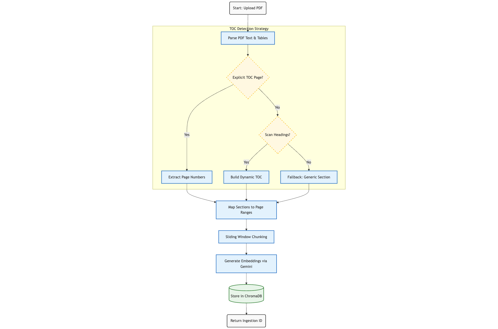
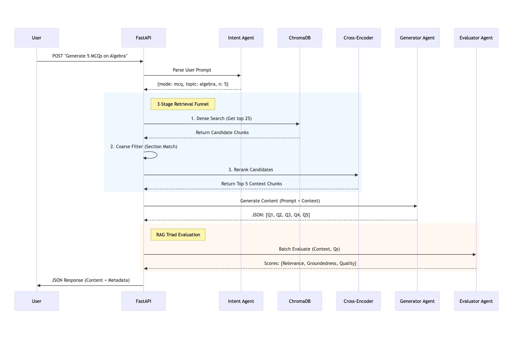

# Educational Content Generator

A RAG-based API that ingests PDF documents and generates educational content (MCQs, fill-in-the-blanks, summaries) using Gemini family of LLMs. Every generated item is quality-scored by an LLM evaluator using the RAG Triad framework.

---

## Table of Contents

- [Quick Start](#quick-start)
- [Project Structure](#project-structure)
- [Architecture](#architecture)
- [API Reference](#api-reference)
- [Configuration](#configuration)
- [Logging](#logging)
- [Free-form Prompt Examples](#free-form-prompt-examples)
- [Future Improvements](#future-improvements)

---

## Quick Start

### Prerequisites

- **Docker** (recommended) and Python 3.13+
- **Google AI Studio API key** - [get one here](https://aistudio.google.com/app/apikey)

### Option A: Docker (Recommended)

```bash
docker build -t lc2 .
docker run -p 8000:8000 -e GOOGLE_API_KEY=<your_key> -v $(pwd)/logs:/app/logs lc2
```

### Option B: Local

```bash
python -m venv venv && source venv/bin/activate
pip install -r requirements.txt
cp .env.example .env        # then add your GOOGLE_API_KEY
python main.py
```

#### Swagger UI will be available here [`http://localhost:8000/docs`](http://localhost:8000/docs).
#### The API is live at `http://localhost:8000`.

---

## Project Structure

```
LC2/
├── main.py                    # FastAPI app, endpoint definitions, request orchestration
├── config.py                  # All configuration constants (models, chunking, paths)
├── models.py                  # Pydantic schemas for API request/response contracts
├── requirements.txt           # Python dependencies
├── Dockerfile                 # Container build instructions
├── .env.example               # Environment variable template (API key only)
├── .dockerignore              # Files excluded from Docker build context
├── .gitignore                 # Files excluded from version control
│
├── ingest/                    # PDF ingestion pipeline
│   ├── parser.py              # PDF text/table extraction, TOC detection, section mapping
│   └── chunker.py             # Sliding-window chunking, embedding, ChromaDB storage
│
├── agents/                    # LLM-powered generation and evaluation
│   ├── generator.py           # Intent parsing, MCQ/fill-blank/summary generation
│   ├── prompts.py             # All LLM prompt templates
│   └── evaluation.py          # RAG Triad batch evaluation via LLM judge
│
├── utils/                     # Shared utilities
│   ├── retrieval.py           # 3-stage retrieval: dense search, topic filter, reranking
│   └── log_handler.py         # Per-request file logging context manager
│
├── chroma_db/                 # ChromaDB persistent storage (auto-created, gitignored)
├── uploaded_pdfs/             # Uploaded PDF files (auto-created, gitignored)
└── logs/                      # Per-request log files (auto-created, gitignored)
```

### File Descriptions

| File | Purpose |
|---|---|
| `main.py` | FastAPI application with three endpoints (`/`, `/ingest`, `/generate`). Orchestrates the full pipeline: upload, parse, chunk, embed, retrieve, generate, evaluate. Handles error mapping to HTTP status codes. |
| `config.py` | Single source of truth for all configuration: Gemini model names, chunking parameters, ChromaDB path, reranker model, logging directory. Only `GOOGLE_API_KEY` comes from the environment. |
| `models.py` | Pydantic models defining the API contract: `IngestResponse`, `GenerateRequest`, `GenerateResponse`, `MCQQuestion`, `FillBlankQuestion`, `Summary`, and metadata types. |
| `ingest/parser.py` | Extracts text and tables from PDFs using pdfplumber. Detects the Table of Contents via three strategies (explicit TOC page, heading scan, fallback). Maps sections to page ranges. |
| `ingest/chunker.py` | Splits section text into overlapping chunks (200 tokens, 50 overlap) with sentence-boundary awareness. Embeds chunks using Gemini embeddings and stores them in ChromaDB with section metadata. |
| `agents/generator.py` | Parses free-form user prompts into structured intents via Gemini. Generates MCQs, fill-in-the-blanks, or summaries by formatting retrieved context into LLM prompts. |
| `agents/prompts.py` | All prompt templates: intent parsing, MCQ generation, fill-blank generation, summary generation, and RAG Triad evaluation. Each enforces JSON-only output. |
| `agents/evaluation.py` | Evaluates all generated items in a single batched LLM call using the RAG Triad framework (context relevance, groundedness, answer relevance). Returns per-item quality scores. |
| `utils/retrieval.py` | 3-stage retrieval funnel: (1) dense vector search via Gemini embeddings, (2) coarse topic filtering by section title, (3) cross-encoder reranking using `ms-marco-MiniLM-L-6-v2`. |
| `utils/log_handler.py` | Context manager that attaches a per-request `FileHandler` to the root logger, capturing all pipeline logs into `logs/{id}.log`. |
| `Dockerfile` | Multi-step Docker build: installs C++ build tools (for ChromaDB), pip dependencies, copies app code, exposes port 8000. |

---

## Architecture

### Ingest Pipeline (`POST /ingest`)

<p align="center">
  
</p>

The ingest pipeline takes a PDF upload and prepares it for retrieval. Text and tables are extracted using pdfplumber, and the Table of Contents is detected via three cascading strategies (explicit TOC page, heading scan, fallback). Each section is then split into overlapping chunks (200 tokens, 50 overlap) with sentence-boundary awareness, while tables are stored as standalone chunks. All chunks are embedded using the Gemini Embedding API and persisted in ChromaDB with section and page metadata.

### Generate & Evaluate Pipeline (`POST /generate`)

<p align="center">
  
</p>

The generate pipeline starts by parsing the user's free-form prompt into a structured intent (mode, topic, count, difficulty) using Gemini. It then runs a 3-stage retrieval funnel: dense vector search fetches 5x candidates, coarse filtering narrows by section title, and a cross-encoder reranker selects the top-k most relevant chunks. The retrieved context is formatted into structured prompts and sent to Gemini to generate MCQs, fill-in-the-blanks, or summaries. Finally, a separate Gemini judge evaluates all generated items in a single batched call using the RAG Triad framework (context relevance, groundedness, answer relevance), attaching a quality score to each item.

---

## API Reference

Post deployment with Docker, it is recoemmended to use FasAPI Swagger UI to execeute the APIs at [http://localhost:8000/docs](http://localhost:8000/docs).

### `GET /` - Health Check

```json
{
  "status": "healthy",
  "service": "Educational Content Generator",
  "version": "1.0.0"
}
```

### `POST /ingest` - Ingest a PDF

Upload a PDF file for parsing, chunking, and embedding.

**Request:** `multipart/form-data` with a `file` field (PDF only)

```bash
curl -X POST http://localhost:8000/ingest -F "file=@textbook.pdf"
```

**Response:**

```json
{
  "ingestion_id": "903aff78-d445-4866-b3f2-7ae6e27dafbe",
  "file_name": "textbook.pdf",
  "pages": 31,
  "toc": [
    {"section": "1 Simplifying Expressions"},
    {"section": "2 Linear Equations"}
  ],
  "summary": "Successfully ingested 74 chunks from 31 pages.",
  "stats": {
    "n_chunks": 74,
    "n_tables": 2,
    "n_equations": 0
  }
}
```

### `POST /generate` - Generate Learning Content

Generate MCQs, fill-in-the-blanks, or summaries from an ingested PDF.

**Request:** `application/json`

```json
{
  "ingestion_id": "903aff78-d445-4866-b3f2-7ae6e27dafbe",
  "user_prompt": "generate 5 mcqs on linear equations, medium difficulty"
}
```

**Response:**

```json
{
  "request_id": "f1a2b3c4-d5e6-7890-abcd-ef1234567890",
  "generated_learning_content": [
    {
      "id": "a1b2c3d4-e5f6-7890-abcd-ef1234567890",
      "question": "What is the solution to 2x + 4 = 12?",
      "options": {
        "A": "x = 3",
        "B": "x = 4",
        "C": "x = 5",
        "D": "x = 6"
      },
      "correct": "B",
      "explanation": "Subtract 4 from both sides: 2x = 8, then divide by 2: x = 4.",
      "difficulty": "medium",
      "evaluator": {
        "context_relevance_score": 0.9,
        "groundedness_score": 1.0,
        "answer_relevance_score": 0.95,
        "quality_score": 0.95,
        "is_supported": true,
        "reasoning": "The question is directly derived from the context and tests understanding of solving linear equations.",
        "issues": []
      }
    }
  ],
  "metadata": {
    "parsed_intent": {
      "mode": "mcq",
      "topic": "linear equations",
      "n": 5,
      "difficulty": "medium",
      "global_scope": false
    },
    "retrieval_time_ms": 1200,
    "generation_time_ms": 3500,
    "model": "gemini-2.5-flash"
  }
}
```

### Error Responses

| Status | Meaning |
|---|---|
| `400` | Invalid input (non-PDF file, unknown generation mode) |
| `404` | No content found for the given `ingestion_id` |
| `429` | Gemini API rate limit exceeded |
| `500` | Internal error (parsing, chunking, generation, or evaluation failure) |
| `502` | LLM model not found or unavailable |

---

## Configuration

All configuration lives in `config.py`. Only `GOOGLE_API_KEY` is read from the environment (via `.env` file or Docker `-e` flag).

| Parameter | Value | Description |
|---|---|---|
| `GEMINI_LLM_MODEL` | `gemini-2.5-flash` | LLM for generation and intent parsing |
| `GEMINI_EMBEDDING_MODEL` | `models/gemini-embedding-001` | Embedding model for vector search |
| `GEMINI_JUDGE_MODEL` | `gemini-2.5-flash` | LLM for RAG Triad quality evaluation |
| `GENERATION_TEMPERATURE` | `0.2` | Generation temperature (low for factual output) |
| `JUDGE_TEMPERATURE` | `0.0` | Evaluation temperature (deterministic scoring) |
| `MAX_CHUNK_TOKENS` | `200` | Maximum tokens per chunk |
| `CHUNK_OVERLAP_TOKENS` | `50` | Overlap between consecutive chunks |
| `DEFAULT_TOP_K` | `5` | Number of chunks retrieved per query |
| `RERANKER_MODEL` | `cross-encoder/ms-marco-MiniLM-L-6-v2` | Cross-encoder model for retrieval reranking |
| `CHROMA_DB_PATH` | `./chroma_db` | ChromaDB persistent storage directory |
| `LOG_DIR` | `./logs` | Directory for per-request log files |

---

## Logging

Every API call generates a dedicated log file:

- **Ingest calls:** `logs/{ingestion_id}.log`
- **Generate calls:** `logs/{request_id}.log`

Each log file captures the full pipeline trace for that request, including timing for each stage (parsing, chunking, retrieval, generation, evaluation).

When running with Docker, mount the logs directory to persist them on the host:

```bash
docker run -p 8000:8000 -e GOOGLE_API_KEY=<key> -v $(pwd)/logs:/app/logs lc2
```

---

## Free-form Prompt Examples

The system parses natural language into structured intents:

| Prompt | Parsed As |
|---|---|
| `"generate 5 mcqs on linear equations"` | mode=mcq, topic=linear equations, n=5 |
| `"create 10 multiple choice questions about quadratics, hard"` | mode=mcq, topic=quadratics, n=10, difficulty=hard |
| `"make 3 fill in the blanks for the quadratic formula"` | mode=fill_blank, topic=quadratic formula, n=3 |
| `"summarize all sections separately"` | mode=summary_per_section, global_scope=true |

---

## Future Improvements


- **Fine-grained TOC Extraction -** Especially for the PDFs with no explicit TOC, a knowledge-graph based approach to simultaneously generate schema and create chunks.
- **Out of Context COntent Generation -** Using intent matching to generate questions associated to the topic but from outside the uploaded PDFs.
- **Improvised Content Evaluation -** Using SymPy or similar MCP servers to evaluate math questions. Similarly different MCP servers for different topics.
- **Managed Vector Database -** Vector engines like Pinecone & Weaviate for multi-user scalability.
- **Caching -** For local and global levels to speed up generation process.
- **Scanned PDF Support -** Via OCR tools Gemini Vision API.
- **Citation Links -** Mapping generated content back to specific pages.
- **Streaming Responses -** For real-time content generation feedback.
- **Multi-document Queries -** Queriying capability across multiple ingested PDFs.
